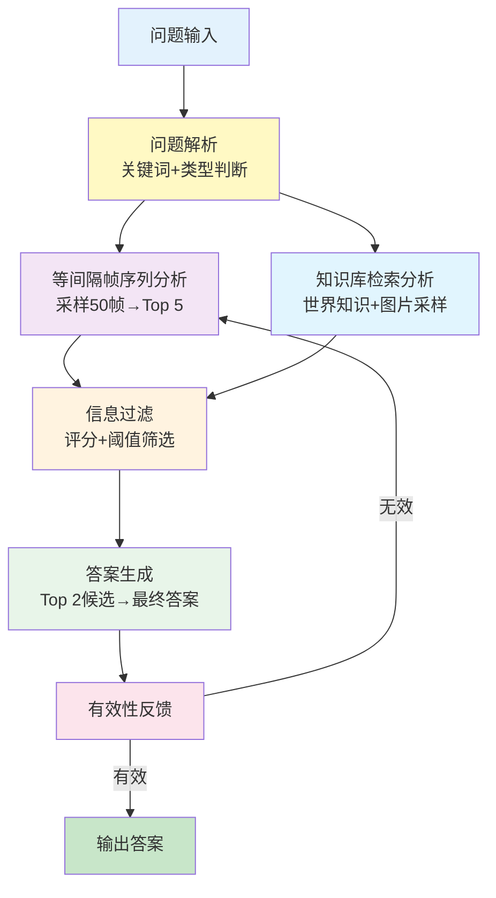

# 基于知识图谱的 3D 场景RAG问答系统


## 目录

- [1. 系统概述](#1-系统概述)
  - [1.1 项目背景](#11-项目背景)
  - [1.2 技术架构](#12-技术架构)
  - [1.3 核心特点](#13-核心特点)
- [2. 通用于 3D 场景的知识图谱构建系统架构与实现](#2-通用于-3d-场景的知识图谱构建系统架构与实现)
  - [2.1 技术架构图](#21-技术架构图-system-architecture)
  - [2.2 通用 3D 场景图生成系统（第一步）](#22-通用-3d-场景图生成系统第一步)
    - [2.2.1 快速开始](#221-快速开始)
      - [2.2.1.1 环境依赖](#2211-环境依赖)
      - [2.2.1.2 模型下载与环境配置指南](#2212-模型下载与环境配置指南)
      - [2.2.1.3 运行指令](#2213-运行指令)
    - [2.2.2 配置文件 (config.yaml)](#222-配置文件-configyaml)
  - [2.3 数据接入标准](#23-数据接入标准)
  - [2.4 输出成果展示](#24-输出成果展示)
  - [2.5 知识图谱构建与入库模块（第二步）](#25-知识图谱构建与入库模块第二步)
    - [2.5.1 图谱模式设计 (Schema)](#251-图谱模式设计-schema)
      - [2.5.1.1 节点定义 (Nodes)](#2511-节点定义-nodes)
      - [2.5.1.2 关系定义 (Relationships)](#2512-关系定义-relationships)
    - [2.5.2 使用说明](#252-使用说明)
      - [2.5.2.1 配置文件 (config_neo4j.yaml)](#2521-配置文件-config_neo4jyaml)
      - [2.5.2.2 启动导入脚本](#2522-启动导入脚本)
    - [2.5.3 效果验证](#253-效果验证)
- [3. RAG视觉问答系统架构与实现](#3-系统架构与实现)
  - [3.1 核心流程图](#31-核心流程图)
  - [3.2 核心模块设计](#32-核心模块设计)
    - [3.2.1 问题解析模块](#321-问题解析模块)
    - [3.2.2 等间隔帧序列分析模块](#322-等间隔帧序列分析模块)
    - [3.2.3 知识库检索模块](#323-知识库检索模块)
    - [3.2.4 答案过滤模块](#324-答案过滤模块)
    - [3.2.5 最终答案生成模块](#325-最终答案生成模块)
    - [3.2.6 答案有效性裁判模块](#326-答案有效性裁判模块)
  - [3.3 技术栈与依赖](#33-技术栈与依赖)
    - [3.3.1 核心技术栈](#331-核心技术栈)
    - [3.3.2 主要依赖库](#332-主要依赖库)
  - [3.4 应用场景](#34-应用场景)
    - [3.4.1 主要应用](#341-主要应用)
    - [3.4.2 扩展能力](#342-扩展能力)
  - [附录](#附录)
    - [A. 核心函数索引](#a-核心函数索引)
    - [B. 配置文件示例](#b-配置文件示例)

***


## 1. 系统概述

### 1.1 项目背景
本系统是一个基于多模态大语言模型的三维场景问答系统，专门针对三维、二维数据集设计。本项目构建了一套通用的 RGB-D 视觉处理流水线，集成了 owlvit (检测)、SAM 2(分割)、CLIP (特征对齐) 及 VLM (**大模型**推理) 等前沿技术实现了空间场景的信息提取。系统通过问题解析、等间隔帧序列分析、知识库检索、答案过滤、最终生成和有效性裁判六个核心阶段，实现了对三维场景视觉问题的智能回答。系统采用分层采样策略、锦标赛选择机制和多轮重采样兜底逻辑，确保了答案的准确性和鲁棒性。

### 1.2 技术架构
系统采用多层次处理架构：
- **输入层**：空间场景RGB帧序列 + 物体知识库
- **处理层**：多阶段采样筛选 + 知识检索 + 答案生成
- **输出层**：经过验证的最终答案

### 1.3 核心特点
- **通用性强**：不再局限于特定数据集，通过配置适配各类 RGB-D 数据。*
- **全自动化**：支持批量扫描、**断点**续跑，无人值守运行。*
- **语义丰富**：生成的 3D 场景图包含物体颜色、材质及空间关系，为具身智能提供数据支撑。*
- **智能问题分析**：自动识别空间关系、状态问题和动作意图
- **分层采样策略**：结合等间隔帧序列分析和知识库驱动的目标采样
- **多模态对比**：VLM实时图像对比锦标赛选择
- **鲁棒性保证**：多级重采样机制和错误处理
- **可解释性**：完整的过程日志和决策路径追踪

---


## 2. 通用于 3D 场景的知识图谱构建系统架构与实现
## 2.1 技术架构图 (System Architecture)


## 2.2 通用 3D 场景图生成系统（第一步）

### 2.2.1 快速开始

#### 2.2.1.1 环境依赖

 需要安装 PyTorch, OpenAI, Ultralytics 等核心库。 `pip install neo4j pyyamltorch numpy open_clip_torch ultralytics openai pillow tqdm pyyaml` 

#### 2.2.1.2 模型下载与环境配置指南

在运行 `Universal Scene Graph Generation System` 之前，您需要准备好以下 3 个核心模型权重文件，并将它们放置在配置文件指定的 `model_dir` 目录下（默认为 `./weights`）。

##### 核心模型列表

模型用途文件名 (示例)推荐版本作用检测 (Detection)[yolov8l-world.pt](http://yolov8l-world.pt)YOLOv8-World (Large)识别图像中的物体并画框（开放词汇检测）。分割 (Segmentation)[sam_l.pt](http://sam_l.pt)SAM (ViT-L)根据框生成精细的物体轮廓掩码。特征 (Feature)open_clip_pytorch_model.binOpenCLIP (ViT-H-14)提取物体特征向量，用于判断“这是不是同一个物体”。

##### 下载地址与步骤

请按照以下步骤下载模型，并统一放入一个文件夹（例如项目根目录下的 `weights/` 文件夹）。

###### 下载 YOLOv8-World

*这是目前最强的开放词汇检测模型，无需重新训练即可识别几乎所有物体。*

- 下载地址: [HuggingFace - Ultralytics](https://github.com/ultralytics/assets/releases/download/v8.1.0/yolov8l-world.pt)
- 命令行下载:

```Bash
wget https://github.com/ultralytics/assets/releases/download/v8.1.0/yolov8l-world.pt -P ./weights/
```

###### 下载 SAM (Segment Anything Model)

*Meta 发布的最强分割大模型，推荐使用 ViT-L 版本（精度与速度的平衡）。*

- 下载地址: [Facebook Research - SAM Checkpoints](https://dl.fbaipublicfiles.com/segment_anything/sam_vit_l_0b3195.pth)
- 命令行下载:

```Bash
wget https://dl.fbaipublicfiles.com/segment_anything/sam_vit_l_0b3195.pth -O ./weights/sam_l.pt
```

- *(注意：下载下来的文件名是* *sam_vit_l_0b3195.pth**，为了配合代码，建议重命名为* *sam_l.pt**，或者修改* *config.yaml* *中的配置)*

###### 下载 OpenCLIP

*OpenAI* *CLIP 的开源实现，用于提取高质量语义特征。ViT-H-14 是目前效果最好的版本之一。*

- 说明: OpenCLIP 通常不需要手动下载 `.bin` 文件，代码中的 `open_clip.create_model_and_transforms` 会自动从 HuggingFace Hub 下载并缓存。
- 如果必须手动下载 (离线环境):
  - 访问 [HuggingFace - laion/CLIP-ViT-H-14-laion2B-s32B-b79K](https://huggingface.co/laion/CLIP-ViT-H-14-laion2B-s32B-b79K/tree/main)
  - 下载 `open_clip_pytorch_model.bin`。
  - 放入 `weights/` 目录。
  - 注意: 手动加载离线 OpenCLIP 比较复杂，建议让代码首次运行自动下载，默认会缓存在 `~/.cache/huggingface/hub`。
  - 代码修改建议: 保持代码默认，确保网络通畅即可自动下载。如果非要本地加载，需修改代码 `pretrained` 参数指向绝对路径。

#### 2.2.1.3 运行指令

- 批量全自动模式（生产环境推荐）： `python main.py --mode batch`
- 单场景调试模式（开发测试用）： `python main.py --mode single --scene_id 000-hm3d-BFRyYbPCCPE`

### 2.2.2 配置文件 (config.yaml)

*通过修改此文件适配不同**数据源**，无需改动代码。*

```YAML
# ==========================================
# Universal 3D Scene Graph Config
# ==========================================

# [Path Settings] 路径设置
paths:
  dataset_root: "/path/to/your/custom_dataset"   # 你的数据集根目录
  output_base_root: "./output_results"           # 结果输出目录
  class_file: "./scannet200_classes.txt"         # 类别列表文件
  model_dir: "./weights"                         # 模型权重文件夹

# [Data Format] 数据格式适配 (核心修改点)
data_format:
  rgb_suffix: "-rgb.png"    # 彩色图后缀 (例如 .jpg, _color.png)
  depth_suffix: "-depth.png" # 深度图后缀
  pose_suffix: ".txt"       # 位姿文件后缀
  img_width: 640            # 统一处理的宽度
  img_height: 480           # 统一处理的高度

# [Model Weights] 模型权重
models:
  yolo_weight: "yolov8l-world.pt"
  sam_weight: "sam_l.pt"
  clip_weight: "open_clip_pytorch_model.bin"
  clip_model_type: "ViT-H-14"

# [VLM Settings] 大模型配置
vlm:
  model_name: "qwen25-vl"
  api_base: "http://your-api-endpoint/v1"
  api_key: "your-api-key"
  temperature: 0.1
  max_tokens: 20

# [Processing Parameters] 处理参数
params:
  device: "cuda"
  match_thresh: 0.65       # 物体相似度合并阈值
  conf_thresh: 0.15        # YOLO置信度
  depth_scale: 1000.0      # [关键] 深度图数值除以多少等于米 (HM3D是6553.5, TUM是5000)
  stride: 5                # 每隔几帧处理一次 (跳帧)
  end_frame: -1            # -1 处理所有帧
  max_save_images: 20      # 每个物体保存多少张图

# [Batch Execution] 批量运行
batch:
  python_exe: "python"
  continue_on_error: true
```

        


### 2.3 数据接入标准

为了保证系统的通用性，新接入的数据集需满足以下目录结构：

- DatasetRoot/
  - Scene_A/
    - `xxxx.jpg` (RGB图)
    - `xxxx.png` (深度图，16bit)
    - `xxxx.txt` (相机位姿矩阵)
    - `xxxx.txt` (相机内参)
  - Scene_B/ ...

------

### 2.4 输出成果展示

运行结束后，系统将输出以下两类核心数据：

1. 3D 场景图 (Scene Graph JSON)

描述了场景中所有物体的语义信息及空间位置。

```JSON
  {
    "combined_index": 9,
    "label_name": "Brown dining table",
    "center": [
      -0.7423055171966553,
      -2.302781343460083,
      3.815586566925049
    ],
    "dimensions": [
      3.6187422275543213,
      0.08046865463256836,
      6.75449800491333
    ],
    "orig_frame_ids": [
      "00025"
    ],
    "color_analysis": "Brown",
    "material": "Glass",
    "scene_id": "000-hm3d-BFRyYbPCCPE",
    "left_of": [
      8,
      11
    ],
    "right_of": [],
    "above": [],
    "below": [
      8
    ]
  },
```

1. 语义点云 (Semantic Point Cloud)


##  2.5 知识图谱构建与入库模块（第二步）

### 2.5.1 图谱模式设计 (Schema)

在 Neo4j 中构建的图数据模型如下：

#### 2.5.1.1 节点定义 (Nodes)

模块简介

本模块负责将上游生成的3D 场景图 JSON解析并批量导入 Neo4j 图数据库。

通过构建 Scene (场景) - Object (物体) - Attribute (属性) 的图谱结构，实现对 3D 空间数据的语义检索与推理。

> *💡 核心能力*
>
> - *自动化入库：递归扫描数据目录，自动识别新旧数据。*
> - *幂等性设计：支持重复运行，自动去重或覆盖更新。*
> - *关系构建：自动建立空间关系（**LEFT_OF**,* *ABOVE**）及属性关联（材质、颜色）。*


节点标签 (Label)属性 (Properties)说明Scenescene_id, object_count代表一个独立的房间或扫描场景Objectlabel, center, size场景中的具体物体，动态 Label (如 Chair)Materialname材质节点 (如 wood, metal)Colorname颜色节点 (如 red, blue)

#### 2.5.1.2 关系定义 (Relationships)

- 层级关系：`(:Object)-[:IN_SCENE]->(:Scene)` *(隐式关联，通常通过属性索引)*
- 空间关系：`(:Object)-[:LEFT_OF | :ABOVE]->(:Object)`
- 属性关系：`(:Object)-[:MADE_OF]->(:Material)`
- 属性关系：`(:Object)-[:HAS_COLOR]->(:Color)`

### 2.5.2 使用说明

#### 2.5.2.1 配置文件 (`config_neo4j.yaml`)

通过配置文件指定 Neo4j 连接信息及数据源路径。

```YAML
neo4j:
  uri: "bolt://localhost:7688"
  user: "neo4j"
  password: "your_password"

paths:
  # 上游生成结果的根目录
  results_root: "/home/eg4/lsm_test/bishe/框架/通用框架代码/output_results"

options:
  force_update: true  # 是否强制覆盖已存在的场景
  batch_size: 50     # 批量写入大小
```

#### 2.5.2.2 启动导入脚本

```Bash
python import_to_neo4j.py --config config_neo4j.yaml
```

### 2.5.3 效果验证

数据导入后，可在 Neo4j Browser 执行以下 Cypher 语句进行验证。

场景概览：

```Bash
// 查看已导入的场景列表
MATCH (s:Scene) RETURN s.scene_id, s.object_count LIMIT 10;
```


## 3. 系统架构与实现

### 3.1 核心流程图



### 3.2 核心模块设计

#### 3.2.1 问题解析模块

**功能**：理解用户意图、深度分析用户问题，提取关键信息进行知识检索
**实现**：
- 关键词提取与扩展：`extract_keywords_from_question()`
- 空间关系检测：`detect_spatial_relations()` - 识别左右、上下关系
- 状态相关性检测：`detect_state_relevance()` - 识别状态相关问题
- 动作意图判断：判断问题是否涉及某件任务的实现

**技术特点**：
- 子串匹配算法提高关键词覆盖率
- 多维度问题分类（空间/状态/动作）

#### 3.2.2 等间隔帧序列分析模块

**功能**：通过等间隔帧序列分析获得基础候选答案

**实现流程**：
1. **均匀采样**：从场景帧序列中均匀采样50张图片
2. **相关性评分**：使用VLM对每张图片进行问题相关性评分
3. **阈值过滤**：保留评分≥0.7的高质量图片
4. **锦标赛选择**：VLM实时两两对比，选择Top-5图片
5. **答案生成**：为每张选中图片生成独立候选答案

**关键技术**：
- `uniform_sample_images()`：智能均匀采样算法
- `vlm_tournament_select_top_images()`：VLM实时对比选择

#### 3.2.3 知识库检索模块

**功能**：基于关键词在知识库中检索相关物体信息

**实现流程**：
1. **世界知识查询**：通过ConceptNet API获取物体世界知识
2. **目标图片采样**：
   - 状态问题：采样10张图片
   - 非状态问题：采样5张图片
3. **关联性评分**：评估物体与问题的关联程度
4. **阈值过滤**：保留关联评分≥0.7的物体
5. **答案生成**：为每个合格物体生成候选答案

**数据源**：
- Neo4j知识库：存储物体元数据和位置信息
- ConceptNet：提供世界知识背景
- 场景物体图像库：预处理的物体专属图像

#### 3.2.4 答案过滤模块

**功能**：对所有候选答案进行质量评估和筛选

**实现流程**：
1. **VLM实时评分**：对每个候选答案进行多维度评分
2. **质量判断**：检查是否有答案达到0.7阈值
3. **高分候选处理**：对≥0.7的候选进行锦标赛Top-2选择
4. **低分触发重采样**：无高分答案时触发二分间隔重采样

**评分维度**：
- 答案相关性
- 视觉支撑强度
- 逻辑一致性
- 语言表达质量

#### 3.2.5 最终答案生成模块

**功能**：基于Top-2候选生成综合最终答案

**实现**：
- `build_final_prompt()`：构建包含所有候选信息的综合提示
- 支持多模态输入：同时处理文本和图像信息
- 上下文整合：结合场景物体信息和世界知识

#### 3.2.6 答案有效性裁判模块

**功能**：判断最终答案的意义和有效性

**实现**：
- `judge_final_answer()`：智能判断答案质量
- 识别无意义答案：如"无法判断"、"不存在"等
- 触发重采样机制：对无效答案进行重新处理

---

## 3.3 技术栈与依赖

### 3.3.1 核心技术栈

- **编程语言**：Python 3.8+
- **多模态模型**：Qwen2.5-VL (通过OpenAI兼容API)
- **知识图谱**：Neo4j数据库
- **外部知识**：ConceptNet API

### 3.3.2 主要依赖库

```python
# 核心依赖
openai >= 1.0.0          # LLM API客户端
neo4j >= 5.0.0           # 图数据库
pydantic >= 2.0.0        # 数据模型验证
numpy >= 1.24.0         # 数值计算
requests >= 2.31.0       # HTTP客户端
```


---


## 3.4 应用场景

### 3.4.1 主要应用

- **三维场景理解**：帮助用户理解复杂的三维环境
- **虚拟助手**：为元宇宙应用提供智能问答能力
- **教育培训**：三维空间知识的学习和查询
- **设计辅助**：室内设计和建筑设计的智能咨询

### 3.4.2 扩展能力

- **多数据集支持**：可扩展到其他3D数据集
- **多语言支持**：支持中英文问题处理
- **自定义知识库**：可集成领域专业知识


---

## 附录

### A. 核心函数索引

| 函数名 | 位置 | 功能描述 |
|--------|------|----------|
| `extract_keywords_from_question()` | L1851 | 问题关键词提取与扩展 |
| `detect_spatial_relations()` | L2042 | 空间关系检测 |
| `detect_state_relevance()` | L2074 | 状态相关性检测 |
| `uniform_sample_images()` | L1963 | 均匀图像采样 |
| `vlm_tournament_select_top_images()` | L1370 | VLM实时对比选择 |
| `retrieve_relevant_knowledge()` | L1895 | 知识库检索 |
| `judge_final_answer()` | L1346 | 答案有效性裁判 |
| `trigger_resampling_fallback()` | L1529 | 重采样触发机制 |

### B. 配置文件示例

详见`Configuration.md`和YAML配置示例。
