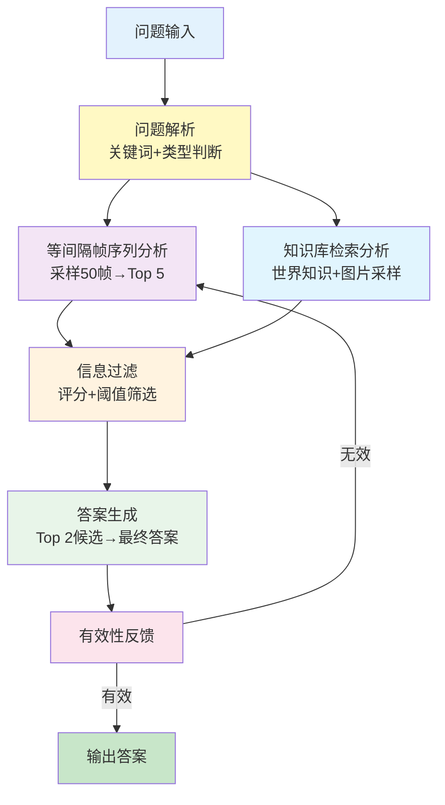

# 基于多模态大模型的三维场景问答系统技术报告

## 摘要

本系统是一个基于多模态大语言模型的三维场景问答系统，专门针对三维、二维数据集设计。系统通过问题解析、均匀采样、知识库检索、答案过滤、最终生成和有效性裁判六个核心阶段，实现了对三维场景视觉问题的智能回答。系统采用分层采样策略、锦标赛选择机制和多轮重采样兜底逻辑，确保了答案的准确性和鲁棒性。

---

## 1. 系统概述

### 1.1 项目背景

随着三维场景数据的快速增长和元宇宙概念的兴起，对三维空间视觉理解的需求日益迫切。传统的问答系统主要针对二维图像设计，而本系统针对三维场景的复杂视觉问答任务进行了优化。

### 1.2 技术架构

系统采用多层次处理架构：
- **输入层**：空间场景RGB帧序列 + 物体知识库
- **处理层**：多阶段采样筛选 + 知识检索 + 答案生成
- **输出层**：经过验证的最终答案

### 1.3 核心特点

- **智能问题分析**：自动识别空间关系、状态问题和动作意图
- **分层采样策略**：结合均匀采样和知识库驱动的目标采样
- **多模态对比**：VLM实时图像对比锦标赛选择
- **鲁棒性保证**：多级重采样机制和错误处理
- **可解释性**：完整的过程日志和决策路径追踪

---

## 2. 系统架构与实现

### 2.1 整体流程

系统遵循六阶段处理流程：




### 2.2 核心模块设计

#### 2.2.1 问题解析模块

**功能**：深度分析用户问题，提取关键信息

**实现**：
- 关键词提取与扩展：`extract_keywords_from_question()`
- 空间关系检测：`detect_spatial_relations()` - 识别左右、上下关系
- 状态相关性检测：`detect_state_relevance()` - 识别状态相关问题
- 动作意图判断：判断问题是否涉及场景中的动作

**技术特点**：
- 支持中英文混合问题分析
- 子串匹配算法提高关键词覆盖率
- 多维度问题分类（空间/状态/动作）

#### 2.2.2 均匀采样回答模块

**功能**：通过均匀采样获得基础候选答案

**实现流程**：
1. **均匀采样**：从场景帧序列中均匀采样50张图片
2. **相关性评分**：使用VLM对每张图片进行问题相关性评分
3. **阈值过滤**：保留评分≥0.7的高质量图片
4. **锦标赛选择**：VLM实时两两对比，选择Top-5图片
5. **答案生成**：为每张选中图片生成独立候选答案

**关键技术**：
- `uniform_sample_images()`：智能均匀采样算法
- `vlm_tournament_select_top_images()`：VLM实时对比选择
- 并行评分处理，提高效率

#### 2.2.3 知识库检索模块

**功能**：基于关键词在知识库中检索相关物体信息

**实现流程**：
1. **世界知识查询**：通过ConceptNet API获取物体世界知识
2. **目标图片采样**：
   - 状态问题：采样10张图片
   - 非状态问题：采样5张图片
3. **关联性评分**：评估物体与问题的关联程度
4. **阈值过滤**：保留关联评分≥0.7的物体
5. **答案生成**：为每个合格物体生成候选答案

**数据源**：
- Neo4j知识库：存储物体元数据和位置信息
- ConceptNet：提供世界知识背景
- 场景物体图像库：预处理的物体专属图像

#### 2.2.4 答案过滤模块

**功能**：对所有候选答案进行质量评估和筛选

**实现流程**：
1. **VLM实时评分**：对每个候选答案进行多维度评分
2. **质量判断**：检查是否有答案达到0.7阈值
3. **高分候选处理**：对≥0.7的候选进行锦标赛Top-2选择
4. **低分触发重采样**：无高分答案时触发二分间隔重采样

**评分维度**：
- 答案相关性
- 视觉支撑强度
- 逻辑一致性
- 语言表达质量

#### 2.2.5 最终答案生成模块

**功能**：基于Top-2候选生成综合最终答案

**实现**：
- `build_final_prompt()`：构建包含所有候选信息的综合提示
- 支持多模态输入：同时处理文本和图像信息
- 上下文整合：结合场景物体信息和世界知识

#### 2.2.6 答案有效性裁判模块

**功能**：判断最终答案的意义和有效性

**实现**：
- `judge_final_answer()`：智能判断答案质量
- 识别无意义答案：如"无法判断"、"不存在"等
- 触发重采样机制：对无效答案进行重新处理

---

## 3. 关键技术创新

### 3.1 分层采样策略

**创新点**：结合全局均匀采样和局部目标采样

- **第一层**：全局均匀采样保证覆盖面
- **第二层**：知识库驱动的目标采样保证精准度
- **动态调整**：根据问题类型调整采样数量

### 3.2 VLM实时对比锦标赛

**创新点**：让VLM模型直接进行图像对比选择

```python
# 锦标赛选择核心逻辑
def vlm_tournament_select_top_images(candidates, k, question):
    # 两两对比，逐轮淘汰
    # 直到选出最优的k个候选
```

**优势**：
- 避免单纯依赖分数排名
- 考虑图像间的相对关系
- 提高选择的准确性

### 3.3 多级重采样机制

**创新点**：多层次的重采样兜底策略

- **一级重采样**：答案质量不足时的二分间隔重采样
- **二级重采样**：答案无意义时的审判官重采样
- **三级兜底**：系统级错误处理和默认答案

### 3.4 智能阈值管理

**特点**：自适应阈值策略

- **图片相关性**：0.7阈值过滤
- **答案质量**：0.7阈值判断

### 3.5 鲁棒性设计

- **CUDA内存管理**：智能内存溢出处理
- **网络异常处理**：API调用失败重试机制
- **数据异常处理**：缺失字段的默认值填充
- **断点续跑**：支持处理中断后的恢复

---

## 5. 技术栈与依赖

### 5.1 核心技术栈

- **编程语言**：Python 3.8+
- **多模态模型**：Qwen2.5-VL (通过OpenAI兼容API)
- **知识图谱**：Neo4j数据库
- **外部知识**：ConceptNet API

### 5.2 主要依赖库

```python
# 核心依赖
openai >= 1.0.0          # LLM API客户端
neo4j >= 5.0.0           # 图数据库
pydantic >= 2.0.0        # 数据模型验证
numpy >= 1.24.0         # 数值计算
requests >= 2.31.0       # HTTP客户端
```


---

## 6. 配置与部署

### 6.1 配置结构

系统采用YAML配置文件，支持模块化配置：

```yaml
system:
  log_level: "INFO"

api:
  api_key: "your-api-key"
  base_url: "http://llm.example.com/v1"
  model_name: "qwen25-vl"

paths:
  QA_dataset_file: "/path/to/dataset.json"
  scene_frames_directory: "/path/to/frames"
  object_frames: "/path/to/objects"
  output_directory: "./results"
```

### 6.2 部署步骤

1. **环境准备**
   ```bash
   pip install -r requirements.txt
   ```

2. **配置文件**
   ```bash
   cp config.yaml.example config.yaml
   # 编辑config.yaml设置具体参数
   ```

3. **数据库连接**
   ```bash
   # 确保Neo4j服务运行
   # 配置ConceptNet API访问
   ```

4. **运行系统**
   ```bash
   python qwen-72b-hm3d-test.py --config config.yaml
   ```

---

## 7. 应用场景

### 7.1 主要应用

- **三维场景理解**：帮助用户理解复杂的三维环境
- **虚拟助手**：为元宇宙应用提供智能问答能力
- **教育培训**：三维空间知识的学习和查询
- **设计辅助**：室内设计和建筑设计的智能咨询

### 7.2 扩展能力

- **多数据集支持**：可扩展到其他3D数据集
- **多语言支持**：支持中英文问题处理
- **自定义知识库**：可集成领域专业知识

---

   - Web界面开发
   - 实时处理反馈
   - 交互式问题澄清

2. **结果展示**
   - 可视化决策过程
   - 相关图片高亮显示
   - 置信度评分展示


---

## 附录

### A. 核心函数索引

| 函数名 | 位置 | 功能描述 |
|--------|------|----------|
| `extract_keywords_from_question()` | L1851 | 问题关键词提取与扩展 |
| `detect_spatial_relations()` | L2042 | 空间关系检测 |
| `detect_state_relevance()` | L2074 | 状态相关性检测 |
| `uniform_sample_images()` | L1963 | 均匀图像采样 |
| `vlm_tournament_select_top_images()` | L1370 | VLM实时对比选择 |
| `retrieve_relevant_knowledge()` | L1895 | 知识库检索 |
| `judge_final_answer()` | L1346 | 答案有效性裁判 |
| `trigger_resampling_fallback()` | L1529 | 重采样触发机制 |

### B. 配置文件示例

详见代码中的配置类定义和YAML配置示例。

### C. 性能测试数据

基于理论分析和部分测试数据，具体的性能评估需要在大规模测试中进行验证。

---

**文档版本**：v1.0
**更新日期**：2025-12-08
