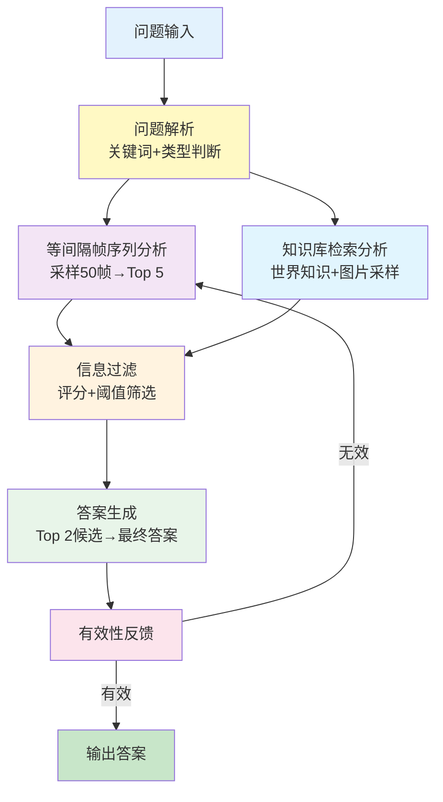

# 基于知识图谱的 3D 场景RAG问答系统


## 目录

- [1. 系统概述](#1-系统概述)
  - [1.1 项目背景](#11-项目背景)
  - [1.2 技术架构](#12-技术架构)
  - [1.3 核心特点](#13-核心特点)
- [2. 系统架构与实现](#2-系统架构与实现)
  - [2.1 核心流程图](#21-核心流程图)
  - [2.2 核心模块设计](#22-核心模块设计)
    - [2.2.1 问题解析模块](#221-问题解析模块)
    - [2.2.2 等间隔帧序列分析模块](#222-等间隔帧序列分析模块)
    - [2.2.3 知识库检索模块](#223-知识库检索模块)
    - [2.2.4 答案过滤模块](#224-答案过滤模块)
    - [2.2.5 最终答案生成模块](#225-最终答案生成模块)
    - [2.2.6 答案有效性裁判模块](#226-答案有效性裁判模块)
- [3. 技术栈与依赖](#3-技术栈与依赖)
  - [3.1 核心技术栈](#31-核心技术栈)
  - [3.2 主要依赖库](#32-主要依赖库)
- [4. 应用场景](#4-应用场景)
  - [4.1 主要应用](#41-主要应用)
  - [4.2 扩展能力](#42-扩展能力)
- [附录](#附录)
  - [A. 核心函数索引](#a-核心函数索引)
  - [B. 配置文件示例](#b-配置文件示例)

***


## 1. 系统概述

### 1.1 项目背景
本系统是一个基于多模态大语言模型的三维场景问答系统，专门针对三维、二维数据集设计。本项目构建了一套通用的 RGB-D 视觉处理流水线，集成了 owlvit (检测)、SAM 2(分割)、CLIP (特征对齐) 及 VLM (**大模型**推理) 等前沿技术实现了空间场景的信息提取。系统通过问题解析、等间隔帧序列分析、知识库检索、答案过滤、最终生成和有效性裁判六个核心阶段，实现了对三维场景视觉问题的智能回答。系统采用分层采样策略、锦标赛选择机制和多轮重采样兜底逻辑，确保了答案的准确性和鲁棒性。

### 1.2 技术架构
系统采用多层次处理架构：
- **输入层**：空间场景RGB帧序列 + 物体知识库
- **处理层**：多阶段采样筛选 + 知识检索 + 答案生成
- **输出层**：经过验证的最终答案

### 1.3 核心特点
- **通用性强**：不再局限于特定数据集，通过配置适配各类 RGB-D 数据。*
- **全自动化**：支持批量扫描、**断点**续跑，无人值守运行。*
- **语义丰富**：生成的 3D 场景图包含物体颜色、材质及空间关系，为具身智能提供数据支撑。*
- **智能问题分析**：自动识别空间关系、状态问题和动作意图
- **分层采样策略**：结合等间隔帧序列分析和知识库驱动的目标采样
- **多模态对比**：VLM实时图像对比锦标赛选择
- **鲁棒性保证**：多级重采样机制和错误处理
- **可解释性**：完整的过程日志和决策路径追踪

---

## 2. 系统架构与实现

### 2.1 核心流程图



### 2.2 核心模块设计

#### 2.2.1 问题解析模块

**功能**：理解用户意图、深度分析用户问题，提取关键信息进行知识检索
**实现**：
- 关键词提取与扩展：`extract_keywords_from_question()`
- 空间关系检测：`detect_spatial_relations()` - 识别左右、上下关系
- 状态相关性检测：`detect_state_relevance()` - 识别状态相关问题
- 动作意图判断：判断问题是否涉及某件任务的实现

**技术特点**：
- 子串匹配算法提高关键词覆盖率
- 多维度问题分类（空间/状态/动作）

#### 2.2.2 等间隔帧序列分析模块

**功能**：通过等间隔帧序列分析获得基础候选答案

**实现流程**：
1. **均匀采样**：从场景帧序列中均匀采样50张图片
2. **相关性评分**：使用VLM对每张图片进行问题相关性评分
3. **阈值过滤**：保留评分≥0.7的高质量图片
4. **锦标赛选择**：VLM实时两两对比，选择Top-5图片
5. **答案生成**：为每张选中图片生成独立候选答案

**关键技术**：
- `uniform_sample_images()`：智能均匀采样算法
- `vlm_tournament_select_top_images()`：VLM实时对比选择

#### 2.2.3 知识库检索模块

**功能**：基于关键词在知识库中检索相关物体信息

**实现流程**：
1. **世界知识查询**：通过ConceptNet API获取物体世界知识
2. **目标图片采样**：
   - 状态问题：采样10张图片
   - 非状态问题：采样5张图片
3. **关联性评分**：评估物体与问题的关联程度
4. **阈值过滤**：保留关联评分≥0.7的物体
5. **答案生成**：为每个合格物体生成候选答案

**数据源**：
- Neo4j知识库：存储物体元数据和位置信息
- ConceptNet：提供世界知识背景
- 场景物体图像库：预处理的物体专属图像

#### 2.2.4 答案过滤模块

**功能**：对所有候选答案进行质量评估和筛选

**实现流程**：
1. **VLM实时评分**：对每个候选答案进行多维度评分
2. **质量判断**：检查是否有答案达到0.7阈值
3. **高分候选处理**：对≥0.7的候选进行锦标赛Top-2选择
4. **低分触发重采样**：无高分答案时触发二分间隔重采样

**评分维度**：
- 答案相关性
- 视觉支撑强度
- 逻辑一致性
- 语言表达质量

#### 2.2.5 最终答案生成模块

**功能**：基于Top-2候选生成综合最终答案

**实现**：
- `build_final_prompt()`：构建包含所有候选信息的综合提示
- 支持多模态输入：同时处理文本和图像信息
- 上下文整合：结合场景物体信息和世界知识

#### 2.2.6 答案有效性裁判模块

**功能**：判断最终答案的意义和有效性

**实现**：
- `judge_final_answer()`：智能判断答案质量
- 识别无意义答案：如"无法判断"、"不存在"等
- 触发重采样机制：对无效答案进行重新处理

---

## 3. 技术栈与依赖

### 3.1 核心技术栈

- **编程语言**：Python 3.8+
- **多模态模型**：Qwen2.5-VL (通过OpenAI兼容API)
- **知识图谱**：Neo4j数据库
- **外部知识**：ConceptNet API

### 3.2 主要依赖库

```python
# 核心依赖
openai >= 1.0.0          # LLM API客户端
neo4j >= 5.0.0           # 图数据库
pydantic >= 2.0.0        # 数据模型验证
numpy >= 1.24.0         # 数值计算
requests >= 2.31.0       # HTTP客户端
```


---


## 4. 应用场景

### 4.1 主要应用

- **三维场景理解**：帮助用户理解复杂的三维环境
- **虚拟助手**：为元宇宙应用提供智能问答能力
- **教育培训**：三维空间知识的学习和查询
- **设计辅助**：室内设计和建筑设计的智能咨询

### 4.2 扩展能力

- **多数据集支持**：可扩展到其他3D数据集
- **多语言支持**：支持中英文问题处理
- **自定义知识库**：可集成领域专业知识


---

## 附录

### A. 核心函数索引

| 函数名 | 位置 | 功能描述 |
|--------|------|----------|
| `extract_keywords_from_question()` | L1851 | 问题关键词提取与扩展 |
| `detect_spatial_relations()` | L2042 | 空间关系检测 |
| `detect_state_relevance()` | L2074 | 状态相关性检测 |
| `uniform_sample_images()` | L1963 | 均匀图像采样 |
| `vlm_tournament_select_top_images()` | L1370 | VLM实时对比选择 |
| `retrieve_relevant_knowledge()` | L1895 | 知识库检索 |
| `judge_final_answer()` | L1346 | 答案有效性裁判 |
| `trigger_resampling_fallback()` | L1529 | 重采样触发机制 |

### B. 配置文件示例

详见`Configuration.md`和YAML配置示例。
